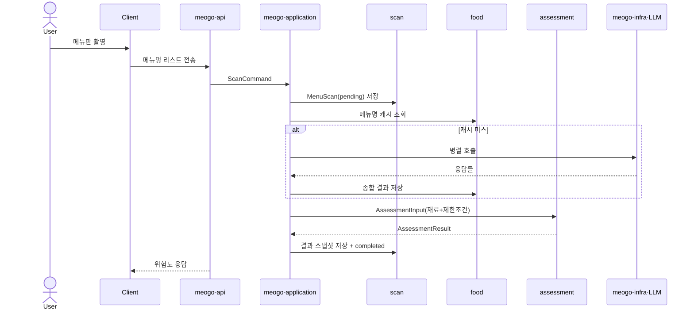

# mermaid-flows

## Overview

문서의 본체는 **산문(템플릿)**이다. 다이어그램은 그것을 대체하지 않고, **복잡한 흐름의 가독성을 높이는 보조**다 — 순서·분기·실패 경로가 글만으로 묻힐 때 mermaid로 보강한다. 기획 변경 시 diff도 명확해진다.

핵심 원칙: **글 먼저, 복잡한 교차-컨텍스트 흐름에만 다이어그램 추가.** 다이어그램으로 도배하지 않는다 — 단순 흐름은 글로 충분하다. 다이어그램은 마크다운 안 ` ```mermaid ` 펜스 블록에 둔다(GitHub·대부분 뷰어가 바로 렌더).

## When to use

- 유스케이스가 **2개 이상의 컨텍스트/액터**를 거칠 때 → `sequenceDiagram`
- 분기·조건(캐시 히트/미스, 성공/실패)이 핵심일 때 → `flowchart TD` 또는 sequence의 `alt`/`opt`
- 엔티티의 **상태 전이**(pending→completed→failed)를 보일 때 → `stateDiagram-v2`
- **쓰지 않을 때**: 단일 컨텍스트 내부 규칙(그건 도메인 문서의 텍스트로), 단순 1~2스텝.

## 다이어그램 종류 선택

| 보여줄 것 | 종류 |
|-----------|------|
| 누가 누구를 어떤 순서로 호출하는가 | `sequenceDiagram` (기본) |
| 조건 분기 / 의사결정 트리 | `flowchart TD` |
| 한 엔티티의 라이프사이클 상태 | `stateDiagram-v2` |

## 유스케이스 엔트리 템플릿

````markdown
## UC-N. <유스케이스 이름>

- **트리거**: <누가/무엇이 시작하나>
- **사용 컨텍스트**: `scan`, `food`, `member`, `assessment` ...



> **정책/엣지**: LLM 호출은 DB 트랜잭션 밖. 일부 메뉴 매핑 실패는 부분 완료. 확신 없으면 `SAFE`로 낮추지 않음.
````

## 표준 participant 이름 (이 프로젝트)

다이어그램 전반에서 **같은 이름**을 쓴다. 모듈/컨텍스트 실명과 일치시킬 것:

`User`(actor) · `Client` · `meogo-api` · `meogo-application` · 도메인 컨텍스트는 실명(`scan`/`food`/`member`/`assessment`) · `meogo-infra·LLM` / `meogo-infra·Storage`.

> 다른 repo에서 이 스킬을 쓸 땐 이 목록을 해당 프로젝트의 컴포넌트로 교체한다.

## Mermaid 문법 함정 (자주 깨지는 곳)

- **flowchart/state 노드 라벨**에 괄호 `()`·대괄호가 있으면 파싱 실패 → 따옴표로 감싼다: `A["risk (0/1/2)"]`. (sequenceDiagram **메시지**는 콜론 뒤 자유 텍스트라 괄호 OK, 따옴표 쓰면 따옴표가 그대로 렌더되니 쓰지 말 것.)
- 줄바꿈은 `<br/>` 사용.
- participant 별칭은 `participant App as meogo-application`처럼 별칭으로 두고, 화살표에선 짧은 별칭(`App`)을 쓴다(긴 실명 직접 사용 시 특수문자 깨짐 방지).
- 분기는 `alt`/`else`/`end`, 선택적 단계는 `opt`/`end`, 반복은 `loop`/`end`.
- 노트는 `Note over A,B: ...` 로 정책·제약을 다이어그램 안에 박는다.

## Common mistakes

- 다이어그램 없이 글로만 흐름 서술 → 변경 추적이 어려움. 흐름이면 다이어그램부터.
- participant 이름을 매번 다르게 씀 → 문서 간 대조 불가. 표준 이름 고정.
- 한 다이어그램에 모든 유스케이스를 욱여넣음 → 유스케이스당 하나로 분리.
- 정책(트랜잭션 경계·실패 처리·스냅샷)을 빼먹음 → `Note`나 다이어그램 하단 노트로 항상 명시.
