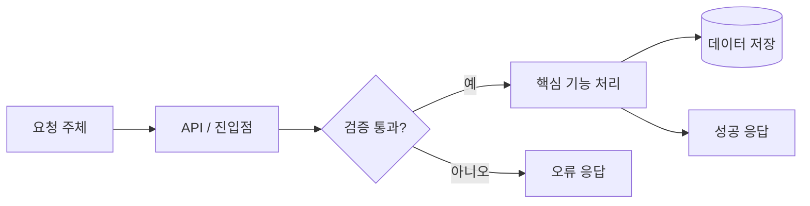

<!--
제목: <feat|fix|refactor|chore>(scope): <PR 전체 결과>

리뷰어가 아래 내용을 빠르게 이해할 수 있도록 작성한다.
- 왜 필요한가
- 무엇이 바뀌었는가
- 기능이 어떤 순서로 동작하는가
-->

### Issue Number

<!-- default 브랜치 머지 시 종료할 GitHub 이슈 -->
- close #

<!-- Jira로 관리한다면 아래 형식 사용 -->
<!-- > **Jira:** [KB-000](https://<site>.atlassian.net/browse/KB-000) -->

## 무엇을 / 왜

<!--
기존에 어떤 문제가 있었고 이 PR이 무엇을 해결하는지 2~4문장으로 작성한다.
변경 파일이나 구현 세부사항은 나열하지 않는다.
-->

## 변경 사항

<!-- 커밋 단위가 아니라 기능·모듈 단위로 작성한다. -->

- **영역 또는 기능** — 무엇을 바꿨고 왜 필요한지
- **영역 또는 기능** — 무엇을 바꿨고 왜 필요한지

## 기능 흐름

<!--
호출 관계, 상태 전이, 비동기 처리 등 동작 흐름이 바뀐 경우 작성한다.
이번 PR에서 변경된 부분을 중심으로 정상 흐름과 중요한 실패 분기를 표시한다.
흐름 변화가 없다면 이 섹션을 삭제한다.
-->

