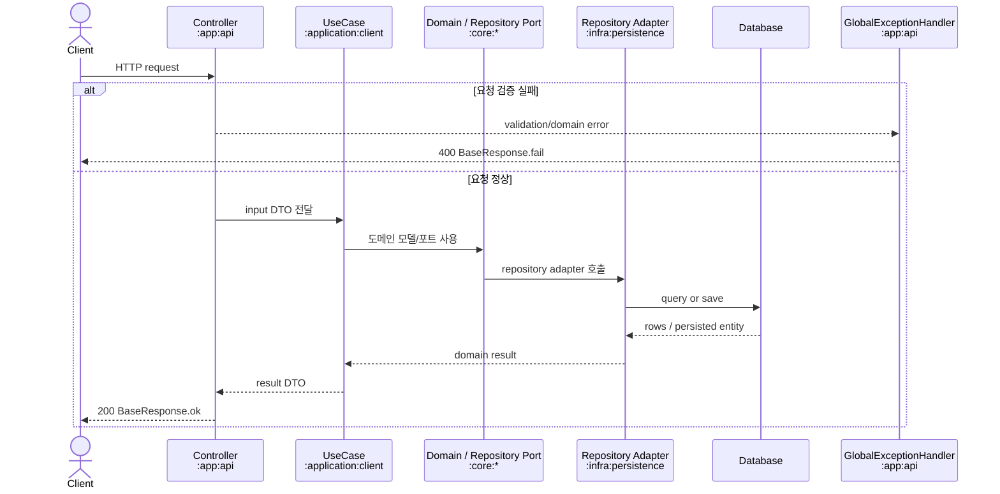
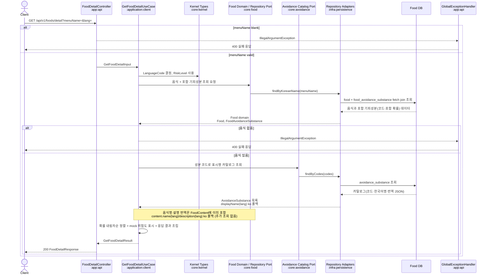
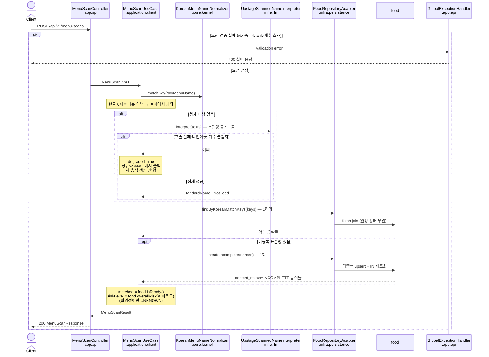

# API Request Flows

멘토 공유용으로, 현재 구현된 API가 어떤 컴포넌트를 거쳐 응답을 만드는지 sequence diagram으로 정리한다.

## 구현된 API

| API | 목적 | 큰 흐름 |
| --- | --- | --- |
| `GET /api/v1/foods/detail` | 한국어 메뉴명으로 음식 상세 조회 | Controller -> UseCase -> Core Repository Port -> Persistence -> DB -> Response |
| `POST /api/v1/menu-scans` | 인식된 메뉴 목록 저장 및 위험도 판정 | Controller -> UseCase -> Core Aggregate/Port -> Persistence -> DB -> Response |

## 사용되는 도메인 모듈

| API | 도메인 모듈 | 역할과 책임 |
| --- | --- | --- |
| 음식 상세 조회 | `:core:food` | `Food`, `FoodContent`(음식명·설명 + 대상 언어 번역 맵·폴백), `FoodAvoidanceSubstance`, `FoodRepository`를 제공한다. 음식명/설명 번역은 `FoodContent`에 포함되어 음식 로드와 함께 온다(별도 조회 포트 없음). |
| 음식 상세 조회 | `:core:avoidance` | `AvoidanceSubstance`, `AvoidanceSubstanceCode`, `AvoidanceSubstanceRepository`를 제공한다. 성분 코드로 표시명 카탈로그를 조회해 요청 언어 표시명(ko 폴백)을 해석한다. |
| 음식 상세 조회 | `:core:kernel` | `LanguageCode`, `RiskLevel` 같은 공통 타입을 제공한다. 언어 코드와 위험도 값을 API/유스케이스/도메인 사이에서 공유한다. |
| 메뉴 스캔 제출 | `:core:kernel` · `:core:food` | 스캔은 상태를 갖지 않아 전용 도메인 모듈이 없다. 정규화기·정제 port 는 kernel, 매칭·완성 상태·위험도는 `Food` 가 소유한다. |
| 메뉴 스캔 제출 | `:core:kernel` | `RiskLevel` 같은 공통 타입을 제공한다. 스캔 항목 위험도 값에 사용된다. |

## 공통 요청 구조

## 음식 상세 조회

음식 상세 조회는 현재 별도 캐시 계층 없이 요청마다 DB를 조회한다. 음식명·설명 번역이 `food` 행 JSON 칼럼에 있어 음식 로드와 함께 오므로, `ko`든 아니든 쿼리 수는 동일하다(음식+기피성분 fetch join 1회 + 표시명 카탈로그 1회). KB-48 이전 비-ko 요청의 번역 테이블 추가 조회 2회는 사라졌다.

**응답 계약은 동결이다** — 외부 JSON 키는 이전과 동일하게 `payload.ingredients[].{name,iconRef,inclusionPercent,riskStatus}`를 유지한다(클라이언트 무변경). 내부 의미만 재료→포함 기피성분으로 바뀌며, `inclusionPercent`는 이제 **포함 확률(1~100)**, `name`은 성분 표시명, `iconRef`는 현재 미제공(null)이다.

| 데이터 | 저장 위치 | 조회 시점 |
| --- | --- | --- |
| 음식 기본 정보, 한국어 설명, 맵기 | `food` | 음식 상세 요청마다 |
| 음식명·설명 대상 언어 번역(JSON) | `food.name_translations`·`food.description_translations` | 음식 로드에 포함(별도 조회 없음) |
| 음식-기피성분 매핑, 포함 확률(1~100) | `food_avoidance_substance` | 음식 상세 요청마다(음식과 fetch join 1회) |
| 기피성분 표시명 카탈로그 | `avoidance_substance` | 음식 상세 요청마다(`findByCodes` 1회) |

## 메뉴 스캔 제출

메뉴 스캔은 **아무것도 저장하지 않는다** — 스캔 이력 테이블(`menu_scan`·`scanned_menu_item`)은 제거됐다. 유일한 쓰기는 처음 보는 메뉴를 `food` 에 미완성(`content_status=INCOMPLETE`)으로 등록하는 것이며, 이 음식은 조사 배치가 레시피·설명·번역을 채워 `READY` 로 전이시키기 전까지 목록·검색·상세에 노출되지 않는다.

| 데이터 | 저장 위치 | 사용 시점 |
| --- | --- | --- |
| 처음 본 메뉴 | `food` (`content_status=INCOMPLETE`) | 정제된 표준명이 DB 에 없을 때 |
| 스캔 이력 | 저장하지 않음 | — |
