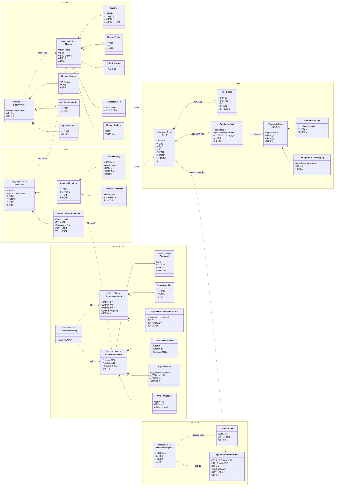

# 유비쿼터스 언어 사전 (Ubiquitous Language)

Meogo 백엔드의 **도메인 용어 ↔ 한국어 뜻**을 한 곳에 모은 사전이다. 도메인 문서([food](./food.md) · [member](./member.md) · [scan](./scan.md) · [assessment](./assessment.md))에서 쓰는 말을 코드·대화·문서에서 동일하게 쓰기 위한 기준이다.

> 용어의 상세 책임·필드 근거는 각 도메인 문서, BC 경계 원칙은 [README.md](./README.md), DDD/모듈 규범은 [`../meogo-conventions.md`](../meogo-conventions.md)를 본다. 이 문서는 **말의 정의와 구조 요약**을 제공하되, 원본 규칙의 단일 출처는 각 도메인 문서와 규범 문서다.

---

## DDD 기본 개념 (이 사전을 읽기 위한 전제)

| 개념 | 한국어 뜻 | Meogo에서의 의미 |
|------|----------|------------------|
| Bounded Context (BC) | 경계 지어진 컨텍스트 | 하나의 도메인 언어가 일관되게 통하는 경계. `meogo-api` 컨테이너 아래 도메인 모듈의 **패키지 경계**로 둔다. Active BC는 `food` · `member` · `scan` · `assessment` · `research` 5개. 같은 단어라도 BC가 다르면 뜻이 다를 수 있다(예: "메뉴명"은 `scan`에선 원문, `food`에선 정규 음식명). |
| Aggregate | 어그리게이트(일관성 단위) | 함께 변경·저장되어야 하는 객체 묶음. **Aggregate Root를 통해서만** 내부 상태를 바꾼다. |
| Aggregate Root (AR) | 어그리게이트 루트 | 그 묶음의 대표 객체이자 유일한 진입점. 외부는 AR의 ID로만 다른 Aggregate를 참조한다. |
| Entity | 엔티티 | 식별자(ID)로 구분되며 생애 동안 상태가 바뀌는 객체. |
| Value Object (VO) | 값 객체 | 식별자 없이 값 자체로 의미를 갖는 불변 객체(예: `AssessmentInput`). |
| Snapshot | 스냅샷 | 시간이 지나면 원본이 바뀌는 값을 **그 시점 그대로** 보존한 사본. 최신 판정은 필요 시 재계산한다. |
| ID 참조 | 아이디 참조 | 다른 Aggregate·Context의 객체 전체를 들지 않고 ID·코드·스냅샷 값만 들고 있는 것. |

### Bounded Context와 Aggregate Root 한눈에

| Context | 한국어 한 줄 정의 | Aggregate Root | 무엇을 담는가 (담는 정보) |
|---------|------------------|----------------|---------------------------|
| `food` | 음식이 무엇이고 어떤 재료/성분으로 이뤄지는지 (검수된 카탈로그) | `Food`, `Ingredient` | 음식 기준 정보(이름·설명은 한국어 원문 + 9개 언어 번역, 이미지), 재료, 음식-재료 관계와 포함 가능성 스코어, 알러지/종교·비건 성분 매핑, 데이터 상태. `FoodIngredient`는 `food` 컨텍스트의 관계 모델이며, `Food`와 `Ingredient`는 서로 다른 Aggregate다. **LLM 조사·종합 출처는 `research`가 소유하고 ID로만 참조한다. 사용자별 위험도는 담지 않는다.** |
| `member` | 사용자가 누구이고 어떤 식이 제한·선호를 갖는지 | `Member`, `DietaryProfile` | 회원 기본 정보·인증 상태, 프로필(닉네임·국적·언어), 식이 제한(알러지·종교·비건), 매운맛 허용도, 관심 음식, 랭킹. **음식 재료나 위험도 계산은 담지 않는다.** |
| `scan` | 보낸 메뉴명이 어떤 음식으로 매핑됐고 당시 무슨 결과를 받았는지 | `MenuScan` | 스캔 사건, 원문 메뉴명·표시 순서, 메뉴명↔Food 매핑 결과와 신뢰도, **당시 위험도 결과 스냅샷**, 클라이언트 OCR 보조 메타데이터. **OCR·위험도 계산은 담지 않는다.** |
| `assessment` | 특정 사용자에게 특정 음식이 안전한지 판정 | `AssessmentResult` 또는 도메인 결과 객체 (정책 도메인) | 위험도(`RiskLevel`), 위험 사유, 재료별 위험, 사장님 질문에 필요한 값. 입력은 전용 VO로만 받고 결과는 도메인 결과 객체로 반환한다. `AssessmentResult`를 영속 생명주기로 관리할 때만 Aggregate Root로 본다. **식이 제한·음식 데이터를 저장하지 않는다.** |
| `research` | 미스 메뉴를 조사해 신뢰할 음식 데이터로 만드는 파이프라인 (배치 전용) | `ResearchRequest` | 조사 대기열(정규화 메뉴명 dedup)·상태, 제공자별 LLM 원본 응답, 종합 결과(`SynthesizedFoodProfile`)와 출처·검수 사유. 종합 결과는 `food`가 영속한다. **최종 카탈로그·위험도는 담지 않는다.** |

> `review`는 **현재 구현 범위에서 제외**(보류). 사전에는 용어를 싣지 않는다 → [review.md](./review.md).

---

## 도메인 클래스 다이어그램

백엔드에서 사용할 도메인 클래스 구조다. 실선(`*--`)은 같은 Aggregate 안의 필수 구성, 빈 마름모(`o--`)는 같은 Context 안의 선택적/보조 구성 또는 느슨한 포함, 점선(`..>`)은 **다른 Context·Aggregate를 ID/스냅샷으로 참조**(직접 의존 아님)함을 뜻한다. 컨텍스트 간 조합은 항상 `:application`에서 일어난다.

> 다이어그램이 보여주는 핵심 규칙: `assessment`는 `food`/`member`의 클래스에 **직접 화살표가 없다.** `:application`이 `DietaryProfile`과 `FoodIngredient` 등 원천 데이터를 `AssessmentInput` 안의 전용 값(`DietaryCondition`, `IngredientAssessmentSource`)으로 변환한다. `scan`은 음식 정보를 복제하지 않고 `foodId`와 결과 **스냅샷**만 들고 있다.

---

## food — 음식 컨텍스트

음식이 무엇이고 어떤 재료/성분으로 구성되는지 관리한다. 사용자별 최종 위험도는 판정하지 않는다.

| 도메인 명칭 | 한국어 뜻 | 비고 |
|-------------|----------|------|
| `Food` | 음식 (기준 정보) | **Aggregate Root.** 김치찌개·불고기 같은 음식 단위. 이름/설명(한국어 원문 + 9개 언어 번역)/이미지/카테고리/데이터 상태/출처. |
| `FoodName` | 음식 이름 / 음식 별칭 | 코드 표준명은 `FoodName`. 한 음식이 메뉴판에서 여러 이름으로 등장하며, 별칭은 `FoodName`의 속성으로 표현한다. 원문·정규화 이름, 언어(한국어 원문 + 9개 대상 언어), 우선 표시 여부를 가진다. 매칭은 한국어 기준, 번역명은 표시용. 별칭은 별도 음식으로 취급하지 않는다. |
| `Ingredient` | 재료 | **Aggregate Root.** 간장·새우젓·돼지고기·고춧가루 같은 단위. 여러 음식이 공유. |
| `FoodIngredient` | 음식-재료 관계 | 음식에 그 재료가 들어갈 수 있는지. **포함 가능성 스코어**의 소유자. `food` 컨텍스트 안의 관계 모델이며, `Ingredient`는 객체 전체가 아니라 `ingredientId`로 참조한다. 관계의 변경·조회 생명주기는 구현 단계에서 결정한다. |
| 포함 가능성 스코어 | 재료 포함 정도 (0/1/2) | `0` 일반적으로 미포함 · `1` 매장/레시피 따라 포함 가능 · `2` 일반적으로 포함. 위험도 판정의 입력. 음식 단위 요약은 관련 스코어 평균을 소수점 한 자리까지 반올림해 표시할 수 있지만, 사용자별 최종 위험도를 낮추는 산식으로 쓰지 않는다. |
| `AllergenMapping` | 알러지 성분 매핑 | 재료 ↔ 알러지 유발 성분 연결. 알러지 코드는 `member`와 비교 가능한 공통 코드. |
| `DietaryRestrictionMapping` | 식이 제한 매핑 | 재료 ↔ 종교/비건 제한 조건 연결(돼지고기·해산물·젓갈·육수·동물성 성분 등). |
| 출처 참조 (researchId) | 음식 데이터 생성 출처 | LLM 제공자·응답 요약·종합 결과 같은 provenance는 **`research` 컨텍스트로 이관**(`FoodSource`/`FoodInference` → `SynthesizedFoodProfile`, ADR-0004). `food`는 만든 research를 **ID로만** 참조한다. |
| 데이터 상태 | 음식 데이터 상태 | `생성됨` · `LLM 생성됨` · `검수 필요` · `검수 완료` · `비활성`. 삭제보다 비활성을 우선. |
| 음식 캐시 조회 | 메뉴명 기반 캐시 히트 | 이미 저장된 음식이면 즉시 매핑(스캔은 LLM 호출 안 함). 캐시 미스는 결과 없음으로 응답하고 `research`(배치)가 후속 생성. |

---

## research — 리서치 컨텍스트

미스 메뉴를 조사해 신뢰할 음식 데이터로 만드는 파이프라인. **배치 전용**(사용자 API 미호출). 종합 결과는 `food`가 영속한다. 상세는 [research.md](./research.md), 결정은 [ADR-0004](../../adr/0004-research-bounded-context.md).

| 도메인 명칭 | 한국어 뜻 | 비고 |
|-------------|----------|------|
| `ResearchRequest` | 조사 요청 (대기열 항목) | **Aggregate Root.** 정규화 메뉴명을 **dedup 키**로 하는 조사 대기열 항목. 상태(`대기`·`조사중`·`종합완료`·`실패`)·적재 시각·시도 횟수. 같은 메뉴명은 여러 사용자가 미스를 내도 하나로 모은다(세션 단위 아님). |
| `LlmResponse` | LLM 원본 응답 | 제공자별(OpenAI/Upstage/Gemini) 원본/요약 응답. 일부 제공자 실패가 종합을 막지 않는다. **원본은 그대로 판단에 쓰지 않는다.** |
| `SynthesizedFoodProfile` | 종합 음식 후보 | 여러 응답을 종합한 신뢰 결과(음식명·설명·재료·스코어·9개국어 번역·출처·검수 상태). `food`로 넘겨 영속. 종합 정책은 **순수 도메인 서비스**(IO 없음). 종합 알고리즘은 미결정(ADR-0003). |
| 조사 요청 상태 | 대기열 상태 | `대기` · `조사중` · `종합완료` · `실패`. 실패는 다음 배치 재시도 대상. |

---

## member — 회원 컨텍스트

사용자가 누구이며 어떤 식이 제한·선호를 갖는지 관리한다. 음식 재료 해석·위험도 계산은 하지 않는다. 인증/인가는 내부 하위 영역(책임 분리).

| 도메인 명칭 | 한국어 뜻 | 비고 |
|-------------|----------|------|
| `Member` | 회원 | **Aggregate Root.** 서비스 사용자. 이메일·이메일 인증 상태·회원 상태·가입/탈퇴 시각. |
| `Identity` | 인증·인가 정보 | 코드 표준명은 `Identity`. 인증 제공자·로그인 식별자·권한/역할·마지막 로그인. 문서에서 `Auth`라고 부를 수 있는 영역이지만, 토큰/세션/보안 필터는 도메인이 아닌 API/security 계층 책임이다. |
| `MemberProfile` | 회원 프로필 | 닉네임·국적·사용 언어·프로필 이미지. **사용 언어 ≠ 음식 데이터 저장 언어.** |
| `DietaryProfile` | 식이 제한 프로필 | **Aggregate Root.** 위험도 판정의 입력이 되는 사용자 조건. 알러지·종교·비건·갱신 시각. |
| `MemberAllergen` | 회원 알러지 | 사용자가 가진 알러지 성분. 알러지 코드는 `food` 매핑과 비교 가능한 공통 코드. 심각도·메모. |
| `ReligiousRestriction` | 종교 제한 조건 | 종교상 먹지 못하는 음식/재료 조건. "피해야 하는 재료 조건"만 판정에 필요. |
| `VeganPreference` | 비건/채식 조건 | MVP는 비건 여부만 필수. 락토·오보·페스코 등 세부 채식 유형은 확장 후보. |
| `SpiceTolerance` | 매운맛 허용도 | 0~10 단계. **MVP 위험도 4단계에는 직접 포함하지 않음**(추천·홈 피드 보조용). |
| `InterestedFood` | 관심/먹어본 음식 | 관심 또는 먹어본 한국 음식. 추천·온보딩 개인화용. `foodId` 참조. |
| `MemberRanking` | 회원 랭킹 | 활동 기반 랭킹. **소유권은 `member`.** 리뷰 기능 확정 전까지 계산은 보류/단순 상태. |
| 회원 상태 | 회원 상태 | `가입 대기` · `정상` · `정지` · `탈퇴`. |
| 식이 제한 프로필 상태 | 프로필 입력 상태 | `입력 전` · `입력 완료` · `수정 필요`. 알러지 서비스 특성상 온보딩 필수 권장. |

---

## scan — 스캔 컨텍스트

메뉴판을 스캔한 **사건과 그 결과**를 기록한다. 서버는 OCR을 수행하지 않으며(클라이언트가 메뉴명 추출), 위험도도 직접 계산하지 않는다.

| 도메인 명칭 | 한국어 뜻 | 비고 |
|-------------|----------|------|
| `MenuScan` | 메뉴판 스캔 | **Aggregate Root.** 스캔 한 건. 요청자 ID·스캔 상태·이미지 참조·생성/완료 시각·실패 사유. 부분 실패 표현 가능. |
| `ScannedMenuItem` | 스캔된 메뉴 항목 | 코드 표준명은 `ScannedMenuItem`. 클라이언트가 추출해 보낸 메뉴 항목이며, 일부 문서에서는 인식된 항목이라는 의미로 `RecognizedMenuItem`이라 부를 수 있다. **원문 메뉴명은 반드시 보존.** 같은 이름이 여러 번 나올 수 있어 표시 순서/항목 ID 필요. |
| `FoodMapping` | 음식 매핑 | 원문 메뉴명이 어떤 `Food`로 해석됐는지(또는 결과 없음인지). 매핑 방식·신뢰도·상태. 스캔 시점엔 **캐시 히트 / 결과 없음(미스)** 두 결과뿐. `foodId` 참조. |
| 매핑 상태 | 메뉴명 매핑 상태 | `매핑 완료(캐시 히트)` · `결과 없음(캐시 미스 — research 조사 대기)` · `매핑 실패` · `알 수 없음(UNKNOWN)`. 미스(데이터 없음)와 UNKNOWN(판정 비대상)을 구분. 일부 미스/실패가 전체 스캔 실패는 아님. |
| `ScanAssessmentSnapshot` | 스캔 위험도 스냅샷 | **스캔 당시** 사용자에게 반환한 위험도 결과. 음식명·`RiskLevel`·위험 사유·주의 재료. 원본이 바뀌어도 자동 변경하지 않음(과거 경험 재현용). |
| `ClientScanMetadata` | 클라이언트 보조 메타데이터 | bounding box·OCR confidence·표시 순서·원본 이미지 참조. **UI 재현/디버깅용이며 위험도 판정에 쓰지 않음.** |
| 스캔 상태 | 스캔 처리 상태 | `생성됨` · `처리 중` · `부분 완료` · `완료` · `실패`. 완료 = 사용자에게 반환 가능한 결과 생성됨. |

---

## assessment — 위험도 판정 컨텍스트 (정책 도메인)

특정 사용자에게 특정 음식이 얼마나 안전한지 판정한다. `food`/`member`의 엔티티에 직접 의존하지 않고, Application이 만든 **전용 입력 VO**만 받는다.

| 도메인 명칭 | 한국어 뜻 | 비고 |
|-------------|----------|------|
| `RiskLevel` | 위험도 단계 | `SAFE`(초록 체크) · `CAUTION`(노랑 느낌표) · `DANGER`(빨강 엑스) · `UNKNOWN`(회색 물음표). 전 화면 공통 고정 상수. `UNKNOWN`은 음식/재료 판정 대상이 명확하지 않은 메뉴에만 쓴다. |
| `AssessmentResult` | 판정 결과 | 음식 하나에 대한 사용자별 도메인 결과 객체. 위험도·위험 사유·재료별 위험·사장님 질문 후보·판정 시각. 별도 저장소에서 현재 판정 결과를 생명주기 관리할 때만 **Aggregate Root**로 본다. 스캔 당시 보존 값은 `scan`의 `ScanAssessmentSnapshot`이 소유한다. |
| `AssessmentInput` | 판정 입력 | **Value Object.** Application이 만들어 넘기는 입력. 식이 제한 조건 + 음식 재료 목록 + 포함 스코어 + 알러지/종교/비건 매핑 + 원문 메뉴명. **다른 BC의 영속 모델을 직접 받지 않음.** |
| `DietaryCondition` | 판정용 사용자 제한 조건 | `AssessmentInput` 내부 전용 값. `member`의 `DietaryProfile`을 직접 참조하지 않고 Application이 필요한 제한 유형·코드·심각도만 변환한다. |
| `IngredientAssessmentSource` | 판정용 재료 입력 | `AssessmentInput` 내부 전용 값. `food`의 `FoodIngredient`를 직접 참조하지 않고 Application이 재료 ID·재료명·포함 가능성 스코어·제한 매핑만 변환한다. |
| `AssessmentReason` | 위험 사유 | 원인 재료·원인 제한 조건·위험도·포함 가능성 스코어. `CAUTION`은 "매장별로 다를 수 있음" 맥락 포함. |
| `IngredientRisk` | 재료별 위험 | 재료 하나에 대한 사용자별 위험. 스코어 `2`+충돌→`DANGER` 후보, `1`+충돌→`CAUTION` 후보. 식별된 음식의 재료 데이터가 부족하면 `CAUTION` 후보이며, `UNKNOWN`은 재료 단위 결과가 아니다. |
| `OwnerQuestion` | 사장님 질문 | 사장님에게 보여줄 한국어 질문에 필요한 값. 질문 속 메뉴명은 사용자가 본 **원문 메뉴명**이어야 함. `CAUTION` 재료와 `UNKNOWN` 메뉴(음식/구성 확인)가 대상. |
| `AssessmentPolicy` | 위험도 계산 정책 | 음식/재료 판정 대상이 아니면 `UNKNOWN`. 판정 가능한 음식에서는 여러 사유 중 **가장 높은 위험도 채택.** `DANGER` 하나라도 있으면 `DANGER`, 없고 `CAUTION` 있으면 `CAUTION`. |
| 위험도 우선순위 | 판정 우선순위 | 식별 불가 메뉴는 `UNKNOWN`으로 분기. 판정 가능한 음식 안에서는 `DANGER` > `CAUTION` > `SAFE`. **확실하지 않으면 `SAFE`로 낮추지 않고 `CAUTION`으로 둔다**(알러지 서비스 특성). |

---

## 컨텍스트를 가로지르는 공통 용어

| 도메인 명칭 | 한국어 뜻 | 어디서 쓰나 |
|-------------|----------|-------------|
| 알러지/종교/비건 제한 코드 | 공통 제한 코드 체계 | `member`(사용자 조건)와 `food`(재료 매핑) 양쪽에서 **비교 가능해야 하는 공통 코드.** |
| 원문 메뉴명 | 사용자가 메뉴판에서 본 그대로의 이름 | `scan`이 소유. `assessment`의 `OwnerQuestion`·`food` 매핑에서 그대로 사용(정규 음식명과 구분). |
| 정규화 메뉴명/이름 | 매칭용으로 다듬은 이름 | `scan`·`food` 양쪽에서 메뉴명 매칭에 사용. |
| 스냅샷 | 그 시점 값의 보존 사본 | `scan`의 `ScanAssessmentSnapshot`. 현재 기준 재판정은 `assessment`를 다시 호출하는 별도 흐름. |
| 음식 콘텐츠 언어 | 한국어 원문 + 9개 언어 | 음식명·설명·재료명·주의 성분을 `ko` 원문 + 9개 언어(`zh-Hans`/`en`/`ja`/`zh-Hant`/`vi`/`id`/`th`/`ru`/`es`)로 사전 번역 저장(ADR-0003). 사용자 `사용 언어`는 어느 번역본을 내려줄지 결정. |

---

## 사전 유지 규칙

- 새 도메인 용어가 생기면 **먼저 이 사전에 한국어 뜻과 함께 등록**하고 코드/문서에서 동일하게 쓴다.
- 같은 단어가 BC마다 다른 뜻이면, 각 BC 섹션에 따로 적고 "공통 용어"에 차이를 명시한다.
- 도메인 문서(food/member/scan/assessment)가 단일 출처다. 정의가 충돌하면 도메인 문서를 따르고 이 사전을 갱신한다.
