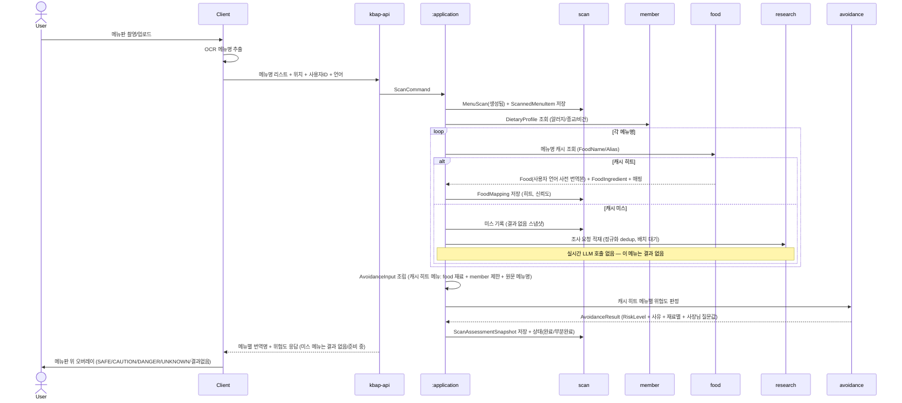
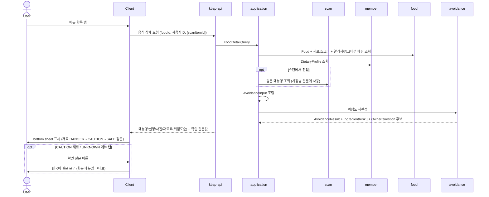
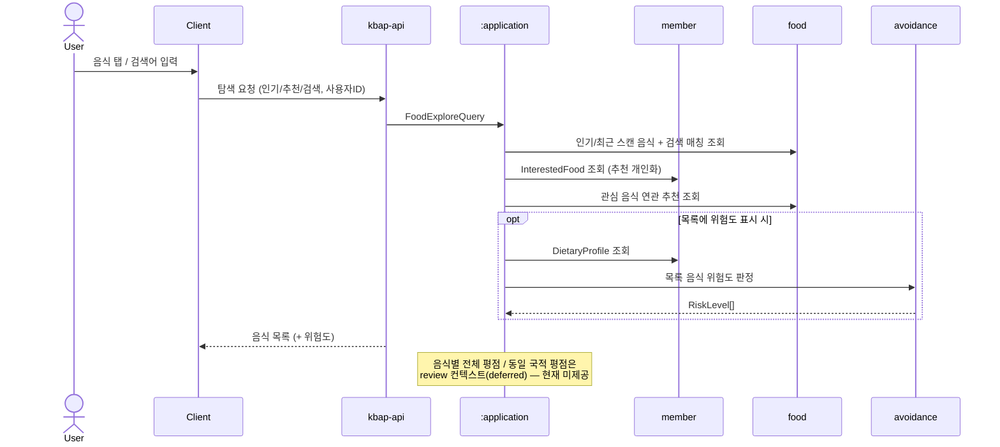
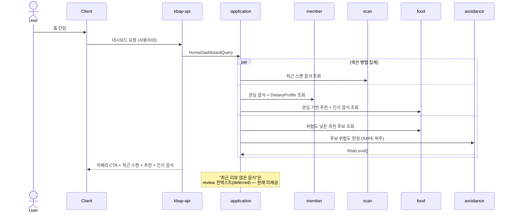
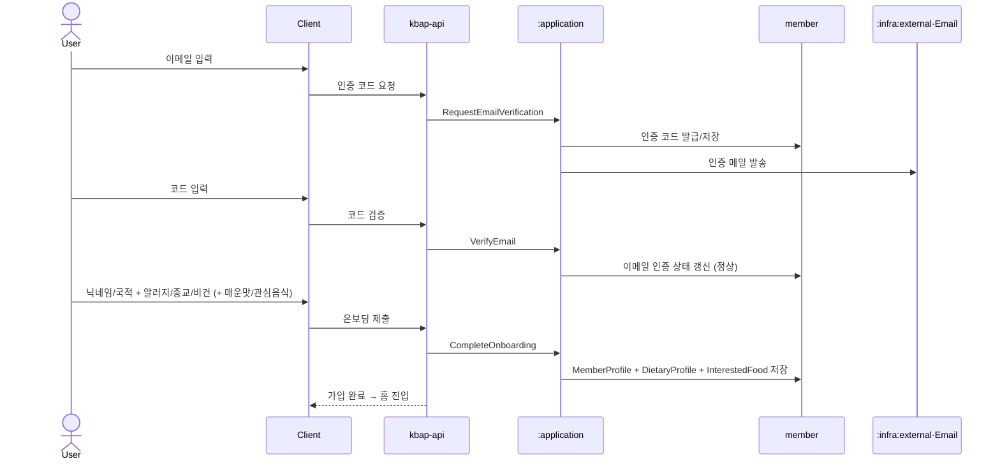
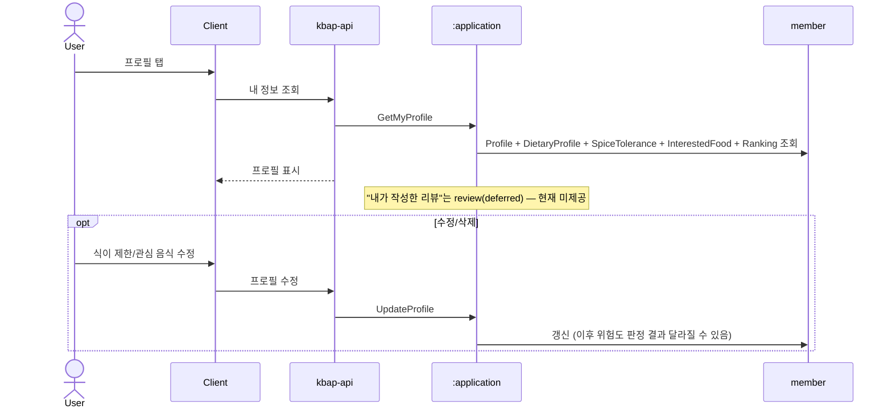
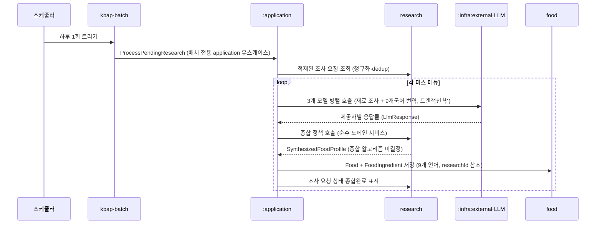

# 유스케이스 흐름 (PRD → 컨텍스트 시퀀스)

각 PRD 화면의 요청이 **어떤 바운디드 컨텍스트를 어떤 순서로 타는지**를 시퀀스 다이어그램으로 정리한다. 컨텍스트 경계·책임은 [`domains/`](./domains/), 데이터/AI 파이프라인은 [`kbap-data-ai-pipeline.md`](./kbap-data-ai-pipeline.md), 모듈 의존 규칙은 [`kbap-conventions.md`](./kbap-conventions.md)·[`kbap-api-module-structure.md`](./kbap-api-module-structure.md) 참고.

## 전제

- **active 컨텍스트는 5개**: `scan` · `food` · `member` · `avoidance` · `research`. `research`는 미스 메뉴 조사·종합(배치 전용, §UC-8). `review`는 deferred([`domains/review.md`](./domains/review.md)) — 아래 §UC-7, §충분성 평가 참고.
- **컨텍스트 간 조합은 `:application`에서만** 일어난다. 도메인 컨텍스트끼리 직접 호출하지 않는다.
- `avoidance`는 `food`/`member`의 영속 모델에 직접 의존하지 않는다. **application 이 `food`·`member` 데이터를 `AvoidanceInput` VO 로 변환**해 넘긴다.
- OCR(메뉴명 추출)은 **클라이언트 책임**. 서버는 메뉴명 리스트를 입력으로 받는다.
- **LLM 호출은 스캔 응답 경로에 없다** — 캐시 미스 메뉴의 조사·종합·9개국어 번역은 `research` 컨텍스트가 소유하고 `kbap-batch`가 **하루 1회** 트리거한다(3개 모델 OpenAI·Upstage·Gemini 병렬, [ADR-0003](../adr/0003-pretranslated-batch-menu-pipeline.md)·[ADR-0004](../adr/0004-research-bounded-context.md)). 스캔 API는 캐시 조회 + 위험도 판정만 동기로 수행하고, 캐시 미스는 결과 없음으로 응답한다. (배치 흐름은 §UC-8.)

표준 participant 이름(다이어그램 전반 고정): `User` · `Client` · `kbap-api`(API) · `:application`(App) · `scan` · `food` · `member` · `avoidance`(Assess) · `research`(Research) · `:infra:external·LLM` · `:infra:external·Email`. 배치는 `kbap-batch`(Batch).

---

## UC-1. 메뉴판 스캔 (PRD 001)

- **트리거**: 사용자가 카메라/갤러리로 메뉴판을 찍고, 클라이언트가 메뉴명을 추출해 전송
- **사용 컨텍스트**: `scan` → `member` → `food` → `avoidance` → `scan` (LLM 없음 — 캐시 미스는 §UC-8 배치가 처리)
- 서비스의 핵심 흐름이며 4개 컨텍스트를 모두 탄다.

> **정책/엣지**
> - 캐시 미스 메뉴는 그 스캔에서 **결과 없음**으로 응답한다(실시간 LLM 호출 안 함). 미스 메뉴명은 적재돼 §UC-8 배치가 처리하며, 다음 스캔부터 결과가 제공된다.
> - 일부 메뉴가 미스/매핑 실패면 **부분 완료**로 표현(스캔 전체 실패 아님).
> - 식별 불가 메뉴(음료·세트·코스·상품명)는 `UNKNOWN` — 재료 판정 대상이 아님. (DB에 아직 없어서 결과 없음인 것과 구분.)
> - 판정 가능한 음식에서 확신이 없으면 `SAFE`로 낮추지 않고 `CAUTION`.
> - `ScanAssessmentSnapshot`은 당시 결과 재현용. 이후 프로필/Food 가 바뀌어도 자동 변경하지 않는다.

---

## UC-2. 음식 상세 + 사장님 확인 질문 (PRD 003)

- **트리거**: 스캔 결과 오버레이에서 메뉴 선택(bottom sheet), 또는 음식 탭에서 진입
- **사용 컨텍스트**: `food` → `member` → `avoidance` (+ 스캔 진입 시 `scan`의 원문 메뉴명)
- 음식 상세는 **현재 프로필 기준 재판정**이다. 스캔 스냅샷(과거값)과 구분된다.

> **정책/엣지**
> - 한국어 질문에 표시되는 메뉴명 = 사용자가 본 **원문 메뉴명**(scan 보존값).
> - `UNKNOWN` 메뉴는 재료표 대신 식별 불가 안내 + "어떤 음식/구성인지" 확인 질문.
> - 음식 콘텐츠(이름/설명/재료)는 한국어 원문 + 9개 언어 사전 번역본 중 사용자 언어로 제공(ADR-0003). 정적 UI 문구도 사용자 언어 사전 번역본.

---

## UC-3. 음식 탐색 · 검색 (PRD 002)

- **트리거**: 음식 탭 진입, 음식명 검색
- **사용 컨텍스트**: `food` + `member`(관심 음식 기반 추천) — **평점/리뷰 부분은 `review`(deferred)**
- 위험도를 같이 보여주려면 목록 항목마다 `avoidance` 호출이 필요(아래 노트).

> **갭**: PRD의 "음식별 전체 평점·동일 국적 평점"은 `review` 의존 → 지금 흐름에 넣을 수 없다. §충분성 평가 참고.

---

## UC-4. 홈 대시보드 (PRD 007)

- **트리거**: 앱 진입/홈 탭
- **사용 컨텍스트**: `member` + `scan` + `food` — **"최근 리뷰 많은 음식"은 `review`(deferred)**
- 여러 컨텍스트를 **읽기 전용으로 집계**하는 흐름.

---

## UC-5. 회원가입 · 온보딩 (PRD 005)

- **트리거**: 앱 설치 후 첫 가입
- **사용 컨텍스트**: `member`(Identity/Auth + 프로필 + 식이 제한) + `:infra:external·Email`
- 단일 컨텍스트 중심이지만 이메일 인증으로 infra 를 한 번 탄다.

> **정책/엣지**: 알러지/종교/비건은 온보딩 **필수 입력**(이후 모든 위험도 판정의 입력). 매운맛·관심 음식은 선택. 알러지/종교 코드는 `food` 매핑과 **공통 코드 체계** 사용.

---

## UC-6. 프로필 관리 (PRD 006)

- **트리거**: 프로필 탭
- **사용 컨텍스트**: `member` 단일 — **"내가 작성한 리뷰"는 `review`(deferred)**
- 컨텍스트 단일 흐름이라 다이어그램은 보조 수준(조회/수정/삭제 CRUD).

> **정책/엣지**: 프로필 변경은 **이후** 판정에만 영향. 과거 스캔 결과는 `scan` 스냅샷으로 보존(덮어쓰지 않음). 랭킹 소유권은 `member`(리뷰 기반 산정은 review 재개 시 재설계).

---

## UC-7. 리뷰 탭 (PRD 004) — 현재 그릴 수 없음 (review deferred)

PRD 004(리뷰 상세·필터·번역)와, 다른 화면에 박혀 있는 리뷰 의존 기능들은 `review` 컨텍스트가 **deferred** 라 실제 백엔드 흐름을 확정할 수 없다. 재개 시 `food`(음식 귀속) + `member`(작성자/국적/랭킹) + 신규 `review` 컨텍스트를 타는 흐름으로 설계된다([`domains/review.md`](./domains/review.md) §3).

`review` 가 없어 **현재 그릴 수 없는 PRD 기능**:

| PRD | 기능 | 막힌 이유 |
|-----|------|-----------|
| 002 음식 탐색 | 음식별 전체 평점·동일 국적 평점 | 평점 집계 = review |
| 003 음식 상세 | 평점 영역·리뷰 상세 진입 | review |
| 004 리뷰 탭 | 리뷰 목록·국적 필터·리뷰 번역 | 컨텍스트 전체 deferred |
| 006 프로필 | 내가 작성한 리뷰, 리뷰 기반 랭킹 산정 | review |
| 007 홈 | 최근 리뷰가 많은 음식 | review |

---

## UC-8. 미스 메뉴 배치 처리 (research 조사·종합)

- **트리거**: 스케줄러 (하루 1회). UC-1에서 캐시 미스로 `research`에 적재된 메뉴를 모아 처리
- **사용 컨텍스트**: `research`(조사 대기열·종합 정책) → `food`(영속) → (`:infra:external·LLM`). 조율은 `:application`의 **배치 전용 유스케이스**, 트리거는 `kbap-batch`([ADR-0004](../adr/0004-research-bounded-context.md))
- 캐시 미스 메뉴의 음식 데이터·다국어 번역을 만들어 캐시를 채운다. 이후 같은 메뉴는 UC-1에서 캐시 히트가 된다([ADR-0003](../adr/0003-pretranslated-batch-menu-pipeline.md)).

> **정책/엣지**
> - **책임 분리**: 큐·종합 정책은 `research`(순수 도메인), LLM 병렬 호출(IO)은 `application`, 트리거는 `kbap-batch`(Job 껍데기) — 로직을 Job에 두지 않는다.
> - LLM 호출은 **DB 트랜잭션 밖**. 일부 메뉴 처리 실패는 부분 성공으로 두고 다음 배치에서 재시도(스캔 응답은 영향 없음).
> - 9개 언어로 번역해 저장하며, 사용자 안전 직결(알러지/식이 제한) 데이터는 검수 상태로 구분한다(`menu-ingredient-allergy-language-report.md` §7).
> - `research`는 **배치 전용** — web 진입점은 이 유스케이스를 노출하지 않는다(ArchUnit 강제).
> - 처리 후 같은 메뉴는 UC-1에서 캐시 히트 — 신규 메뉴는 최대 ~1일 지연 뒤 결과 제공.

---

## 문서 충분성 평가

**충분히 그릴 수 있는 흐름 (active 5 컨텍스트)** — UC-1 ~ UC-6, UC-8(research 배치).
도메인 문서(`domains/*.md`)와 파이프라인 문서가 컨텍스트 경계·책임·관계를 명확히 정의해 시퀀스 도출에 부족함이 없었다.

**문서로는 확정 못 하는 지점 (다이어그램에 `Note`/주석으로 표기)**:

1. **`review` deferred** — 위 §UC-7 표의 PRD 기능들은 흐름을 못 그린다. PRD에는 있으나 백엔드 active 범위 밖. (의도된 deferral, 갭 아님 — 단 PRD와 구현 범위의 불일치를 명시 필요.)
2. **LLM 3개 응답 종합 알고리즘 미결정** — UC-8 배치의 "응답 종합" 단계가 블랙박스(`kbap-data-ai-pipeline.md` §관련 미결정).
3. **음식 목록에서 위험도 표시 여부** — UC-3/UC-4 에서 목록 항목마다 `avoidance` 를 호출할지(비용·성능)가 PRD/문서에 명시 없음. `opt` 로 표기.
4. **온보딩 이메일 인증 어댑터** — `:infra:external·Email` 은 문서에 LLM 만큼 구체화돼 있지 않음(스택 문서엔 미등장). UC-5 는 합리적 추정.
5. **스캔 재판정 트리거(UC-2)** — 상세 진입 시 매번 재판정인지, 스냅샷 우선인지 정책 명시 없음. 현재는 "상세=현재 기준 재판정"으로 가정.

> 결론: **핵심 가치 흐름(스캔→위험도)과 그 주변은 문서만으로 시퀀스가 완성된다.** 비어 있는 칸은 대부분 `review` deferral과 몇 개의 명시적 "미결정" 항목이며, 이는 다이어그램 안에 표시해 두었다.
