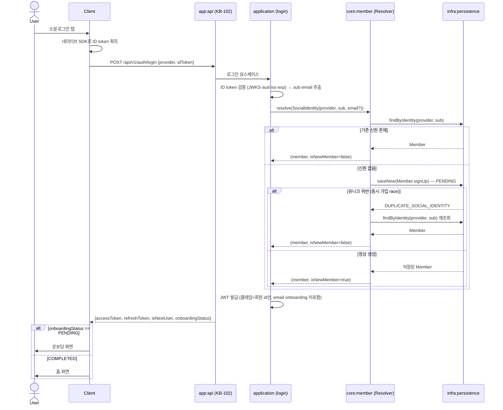
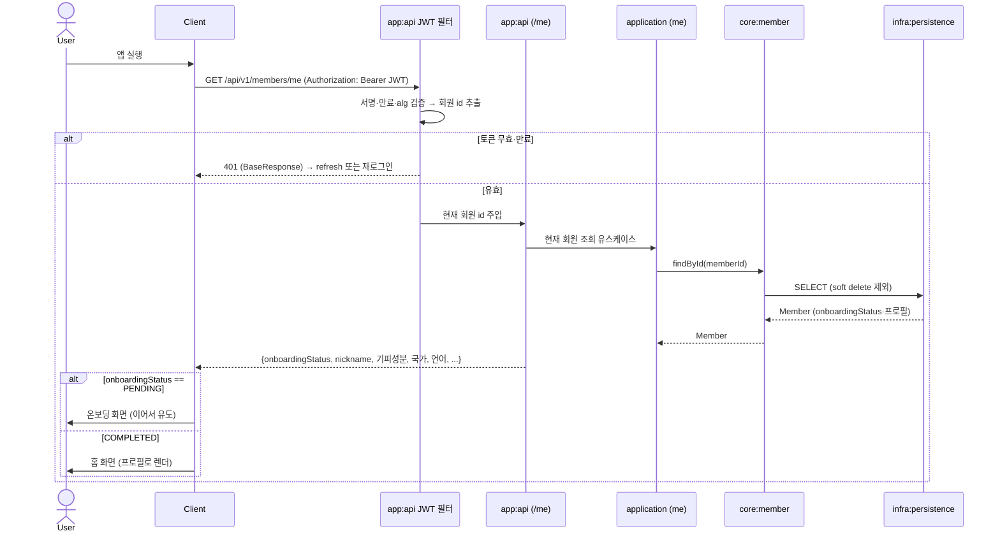

# API Flows: 회원 온보딩 라우팅

> 엔드포인트 경로(`/api/v1/auth/login`·`/api/v1/members/me`)는 예시다 — 요청·응답 계약은 프론트와 협의해 KB-102/KB-104 에서 확정한다. KB-103 범위는 도메인(`:core:member`)+영속(`:infra:persistence`)이며, 로그인·`/me` 엔드포인트 조립은 KB-102/104 몫이다. 온보딩 상태의 단일 진실은 `members.onboarding_status`(DB)이고 **JWT 에는 담지 않는다**.

## UC-1. 소셜 로그인 — 신원 해소 + JWT 발급

- **트리거**: 사용자가 구글/애플 로그인 탭 (최초 가입 또는 재로그인 공통)
- **사용 컨텍스트**: `member`(신원 해소), 인증(KB-102)

> **정책**: 신원 해소 키는 (provider, sub) 단독 — email 은 참고 정보로 저장만(자동 통합 없음). 동시 최초 로그인 race 는 DB 유니크 + 재조회 1회로 한 회원 수렴. JWT 는 회원 id 만.

## UC-2. 앱 재진입 — 저장된 JWT 로 온보딩 상태 hydration

- **트리거**: 사용자가 앱 재실행 (JWT 로컬 보관 상태). 소셜 로그인 재수행 없음.
- **사용 컨텍스트**: `member`(조회), 인증 필터(KB-102) + `/me`(KB-102/104)

> **정책**: 온보딩 여부는 JWT 가 아니라 DB 최신값(`/me`)으로 판단 — 완료 후 토큰 재발급 불필요(R11-a). 재진입 시 어차피 프로필(기피성분·언어)로 화면을 그리므로 `/me` hydration 이 자연스럽다. 온보딩 완료(KB-104 제출) 응답이 COMPLETED 를 돌려주면 클라이언트는 로컬 상태만 갱신.
